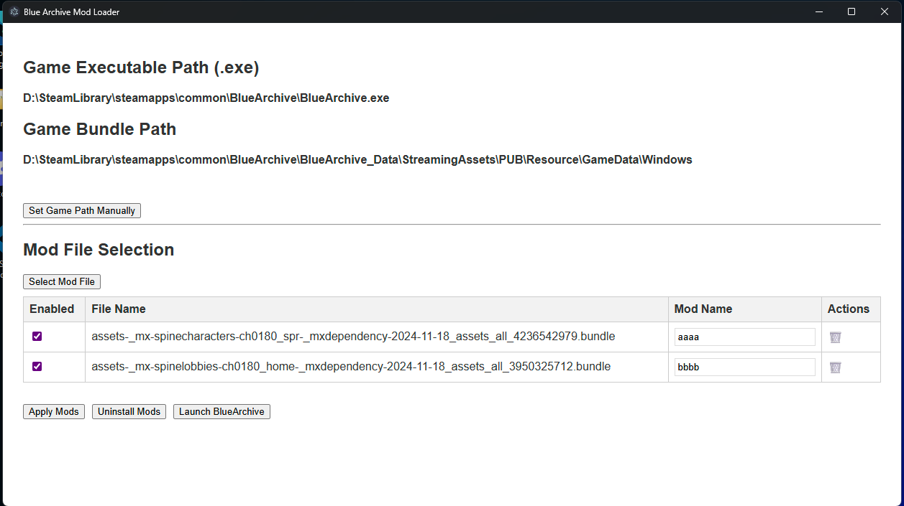

# Blue Archive Mod Loader

A simple Blue Archive Mod manager supporting multi-language (Traditional Chinese/English), Steam launch, mod file management, and automatic/manual game path detection.

## Features
- Multi-language interface (i18n, supports zh-TW/en)
- One-click launch for Blue Archive (Steam version)
- Drag & drop/select mod files, enable/disable, delete
- Auto-detect game path, manual selection also available



## Development

### 1. Install dependencies
```bash
npm install
```

### 2. Start in development mode
```bash
npm start
```

## Installation

[Releases](https://github.com/fiseleo/Blue-Archive-Mod-Loader/releases)

## Usage
1. After launching, the app will auto-detect the game path. If not found, you can set it manually.
2. Click "Select Mod File" to add .bundle files (multi-select supported).
3. You can enable/disable/delete mods, and apply or restore them.
4. Click "Launch Game" to start Blue Archive via Steam.

## Notes
- The ModBundle directory is only created at `%APPDATA%/Blue-Archive-Mod-Loader/ModBundle`. Do not move it manually.

## Development/Contribution
- Main code: `main.js`, `renderer.js`, `preload.js`
- Language files: `locales/zh-TW/translation.json`, `locales/en/translation.json`
- UI: `index.html`


[中文版](READMECH.md)

---

If you have suggestions or questions, feel free to ask!
[Discord](https://discord.gg/nQ4rg4K8QE)

