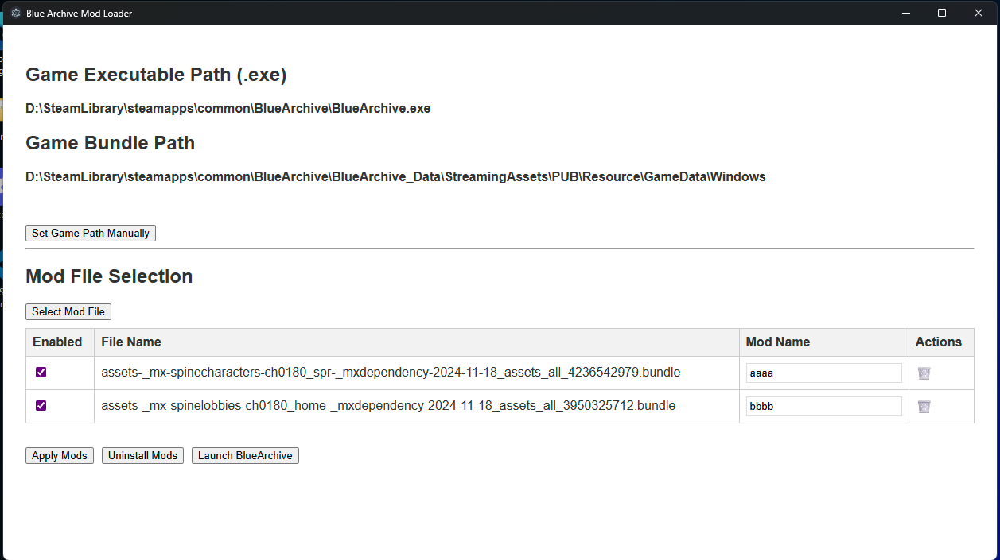

# Blue Archive Mod Loader

一個簡易的 Blue Archive Mod 管理器，支援多語言（繁體中文/英文）、Steam 啟動、Mod 檔案管理與自動/手動遊戲路徑偵測。

## 功能
- 多語言介面（i18n，支援 zh-TW/en）
- 一鍵啟動 Blue Archive（Steam 版）
- Mod 檔案拖曳/選擇、啟用/停用、刪除
- 自動偵測遊戲路徑，亦可手動指定




## 如何開發

### 1. 安裝依賴
```bash
npm install
```

### 2. 開發模式啟動
```bash
npm start
```

## 安裝

[Releases](https://github.com/fiseleo/Blue-Archive-Mod-Loader/releases)


## 使用說明
1. 啟動程式後，會自動偵測遊戲路徑，找不到時可手動指定。
2. 點選「選擇Mod檔案」可加入 .bundle 檔案，支援多選。
3. 可啟用/停用/刪除 Mod，並套用或還原。
4. 點「啟動遊戲」可直接用 Steam 啟動。

## 注意事項
- ModBundle 目錄僅會建立於 `%APPDATA%/Blue-Archive-Mod-Loader/ModBundle`，請勿手動移動。

## 開發/貢獻
- 主要程式碼：`main.js`、`renderer.js`、`preload.js`
- 語言檔：`locales/zh-TW/translation.json`、`locales/en/translation.json`
- UI：`index.html`

---

如有建議或問題，歡迎提出！
[Discord](https://discord.gg/nQ4rg4K8QE)
